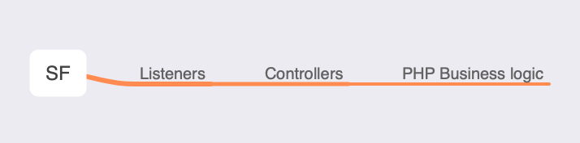
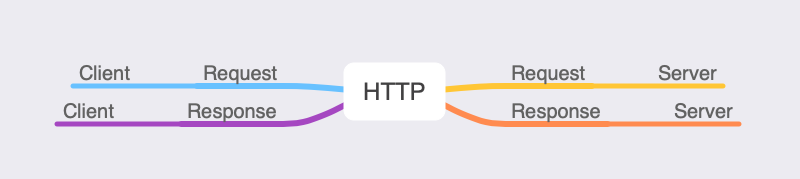

# SFAW
SFAW (SymFony And web another Way) : A new way to explain the web

## Why this repo ? 

Because the best way to understand something is to be able to explain it to a child.

## Controller

### A simple controller

### How a Symfony Request works

## HTTP

